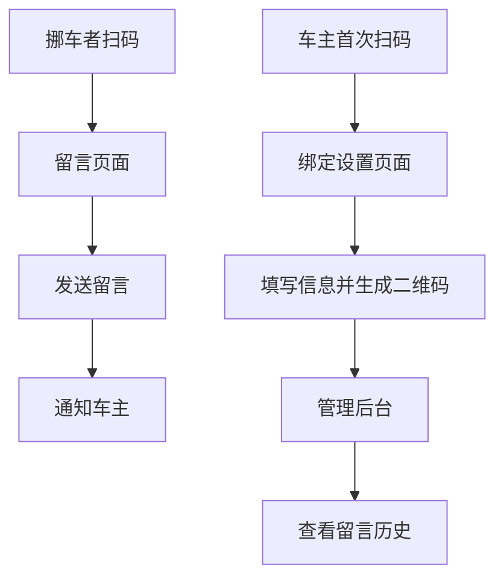

# Car-QR-Move 产品需求文档

## 1. 产品概述

Car-QR-Move 是一个开源全球化二维码挪车工具，让任何车主在 5 分钟内拥有一套「隐私优先、一键自托管」的扫码挪车系统。

- 解决车主手机号暴露和骚扰电话问题，同时让挪车者能够快速联系到车主
- 面向个人开发者、物业管理和企业用户，提供可二次开发的解决方案
- 目标是在90天内获得3k GitHub Stars，成为挪车领域的开源标杆项目

## 2. 核心功能

### 2.1 用户角色

| 角色 | 注册方式 | 核心权限 |
|------|----------|----------|
| 车主 | 首次扫码设置 | 绑定车牌和通知方式，管理留言历史 |
| 挪车者 | 无需注册 | 扫码发送留言，无需安装App |
| 部署者 | Fork项目 | 一键部署，自定义配置，二次开发 |

### 2.2 功能模块

我们的挪车系统包含以下核心页面：

1. **二维码生成页面**：生成唯一UUID二维码，支持PNG/SVG下载
2. **车主绑定页面**：首次扫码设置车牌号和通知方式
3. **访客留言页面**：扫码后输入留言内容
4. **管理后台页面**：查看历史留言，修改通知设置

### 2.3 页面详情

| 页面名称 | 模块名称 | 功能描述 |
|----------|----------|----------|
| 二维码生成页面 | 二维码生成器 | 生成静态URL+UUID的二维码，提供PNG/SVG格式下载 |
| 车主绑定页面 | 绑定表单 | 填写车牌号（可选）和通知方式（Email/WhatsApp/Phone三选一） |
| 访客留言页面 | 留言表单 | 输入留言内容并发送，自动通知车主 |
| 访客留言页面 | 通知系统 | 通过Email/WhatsApp/Phone发送通知给车主 |
| 管理后台页面 | 留言历史 | 查看所有历史留言记录 |
| 管理后台页面 | 设置管理 | 修改通知方式，一键删除数据（GDPR合规） |

## 3. 核心流程

主要用户操作流程如下：

**车主流程：**
1. 车主首次扫码（带setup=1参数）进入绑定页面
2. 填写车牌号（可选）和选择通知方式
3. 生成专属二维码并打印贴在车上
4. 接收挪车通知并及时处理

**挪车者流程：**
1. 扫描车上的二维码
2. 进入留言页面输入挪车请求
3. 系统自动发送通知给车主

## 4. 用户界面设计

### 4.1 设计风格

- **主色调**：蓝色系（#3B82F6）和绿色系（#10B981），体现科技感和环保理念
- **辅助色**：灰色系（#6B7280）用于文本，红色（#EF4444）用于警告
- **按钮样式**：圆角设计，支持3D效果和悬停动画
- **字体**：系统默认字体栈，中文优先使用苹方/微软雅黑，英文使用Inter/Roboto
- **布局风格**：卡片式设计，顶部导航，响应式布局
- **图标风格**：使用Heroicons图标库，简洁现代

### 4.2 页面设计概览

| 页面名称 | 模块名称 | UI元素 |
|----------|----------|--------|
| 二维码生成页面 | 生成器区域 | 居中卡片布局，蓝色主按钮，二维码预览区域，下载按钮组 |
| 车主绑定页面 | 表单区域 | 简洁表单设计，输入框圆角边框，选择器组件，提交按钮突出显示 |
| 访客留言页面 | 留言表单 | 大文本输入框，字符计数器，发送按钮带加载状态 |
| 管理后台页面 | 数据展示 | 表格布局，分页组件，操作按钮组，删除确认弹窗 |

### 4.3 响应式设计

产品采用移动优先的响应式设计，重点优化移动端扫码体验，同时确保桌面端管理功能的易用性。支持触摸交互优化，兼容微信内置浏览器。