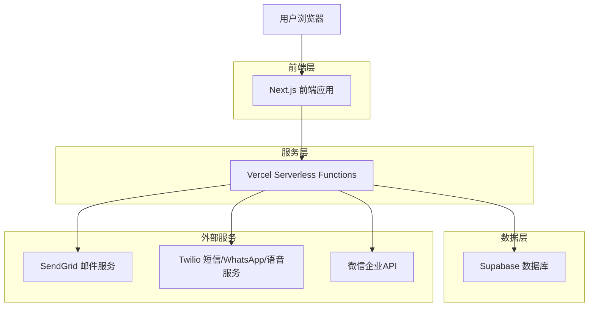
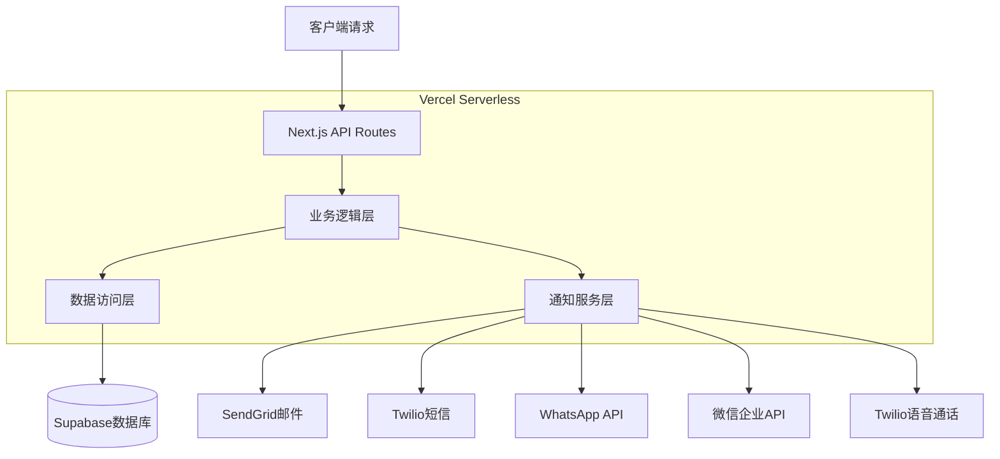
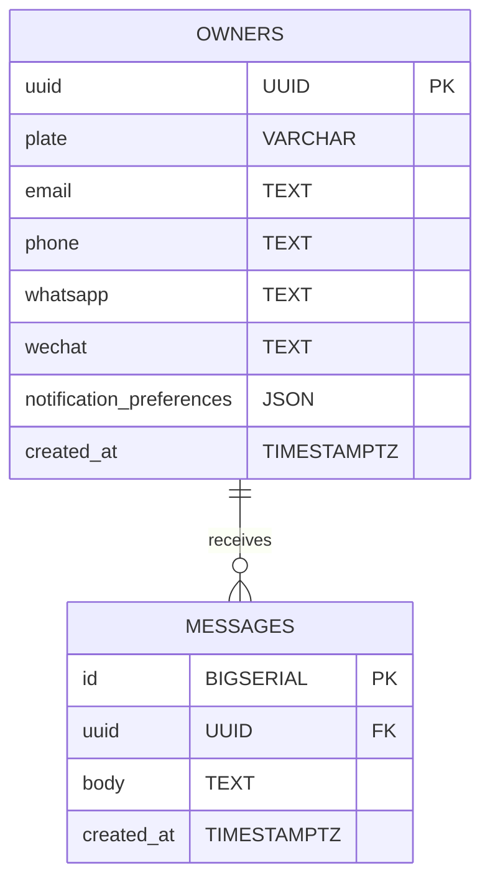

# Car-QR-Move 技术架构文档

## 1. 架构设计



## 2. 技术描述

* **前端**: Next.js\@14 + TailwindCSS\@3 + HeadlessUI + next-intl

* **后端**: Vercel Serverless Functions

* **数据库**: Supabase (PostgreSQL)

* **通知服务**: SendGrid (邮件) + Twilio (短信/WhatsApp/语音) + 微信企业API

* **部署**: Vercel + Docker + Render

## 3. 路由定义

| 路由             | 用途                      |
| -------------- | ----------------------- |
| /              | 首页，展示产品介绍和二维码生成功能       |
| /\[uuid]       | 访客留言页面，扫码后的主要交互界面       |
| /\[uuid]/setup | 车主绑定页面，首次设置车牌和通知方式      |
| /admin/\[uuid] | 管理后台，查看留言历史和修改设置        |
| /api/bind      | 车主绑定API，处理车主信息设置        |
| /api/message   | 留言API，处理访客留言和通知发送       |
| /api/qr        | 二维码生成API，生成PNG/SVG格式二维码 |

## 4. API定义

### 4.1 核心API

**车主绑定接口**

```
POST /api/bind
```

请求参数:

| 参数名                       | 参数类型   | 是否必需  | 描述         |
| ------------------------- | ------ | ----- | ---------- |
| uuid                      | string | true  | 车主唯一标识符    |
| plate                     | string | false | 车牌号码       |
| email                     | string | false | 邮箱地址       |
| phone                     | string | false | 手机号码       |
| whatsapp                  | string | false | WhatsApp号码 |
| wechat                    | string | false | 微信号或企业微信ID |
| notification\_preferences | object | false | 通知方式偏好设置   |

响应参数:

| 参数名     | 参数类型    | 描述     |
| ------- | ------- | ------ |
| success | boolean | 绑定是否成功 |
| message | string  | 响应消息   |

示例:

```json
{
  "uuid": "550e8400-e29b-41d4-a716-446655440000",
  "plate": "京A12345",
  "email": "owner@example.com",
  "phone": "+8613800138000",
  "whatsapp": "+1234567890",
  "wechat": "wechat_user_id",
  "notification_preferences": {
    "email": true,
    "sms": true,
    "whatsapp": false,
    "wechat": true,
    "phone": false
  }
}
```

**留言发送接口**

```
POST /api/message
```

请求参数:

| 参数名  | 参数类型   | 是否必需 | 描述      |
| ---- | ------ | ---- | ------- |
| uuid | string | true | 车主唯一标识符 |
| body | string | true | 留言内容    |

响应参数:

| 参数名           | 参数类型    | 描述       |
| ------------- | ------- | -------- |
| success       | boolean | 发送是否成功   |
| message       | string  | 响应消息     |
| notifications | array   | 通知发送结果详情 |

示例:

```json
{
  "uuid": "550e8400-e29b-41d4-a716-446655440000",
  "body": "您好，您的车挡住了我的车，请尽快挪车，谢谢！"
}
```

**通知状态查询接口**

```
GET /api/notification/status?uuid={uuid}&messageId={messageId}
```

请求参数:

| 参数名       | 参数类型   | 是否必需 | 描述      |
| --------- | ------ | ---- | ------- |
| uuid      | string | true | 车主唯一标识符 |
| messageId | string | true | 消息ID    |

响应参数:

| 参数名      | 参数类型   | 描述           |
| -------- | ------ | ------------ |
| email    | object | 邮件通知状态       |
| sms      | object | 短信通知状态       |
| whatsapp | object | WhatsApp通知状态 |
| wechat   | object | 微信通知状态       |
| phone    | object | 电话通知状态       |

**二维码生成接口**

```
GET /api/qr?uuid={uuid}&format={format}
```

请求参数:

| 参数名    | 参数类型   | 是否必需  | 描述                   |
| ------ | ------ | ----- | -------------------- |
| uuid   | string | true  | 车主唯一标识符              |
| format | string | false | 格式类型 (png/svg，默认png) |

## 5. 服务器架构图



## 6. 数据模型

### 6.1 数据模型定义



### 6.2 数据定义语言

**车主表 (owners)**

```sql
-- 创建车主表
CREATE TABLE owners (
  uuid UUID PRIMARY KEY DEFAULT gen_random_uuid(),
  plate VARCHAR(20),
  email TEXT,
  phone TEXT,
  whatsapp TEXT,
  wechat TEXT,
  notification_preferences JSONB DEFAULT '{"email": true, "sms": false, "whatsapp": false, "wechat": false, "phone": false}'::jsonb,
  created_at TIMESTAMPTZ DEFAULT NOW(),
  updated_at TIMESTAMPTZ DEFAULT NOW()
);

-- 创建索引
CREATE INDEX idx_owners_uuid ON owners(uuid);
CREATE INDEX idx_owners_created_at ON owners(created_at DESC);

-- 设置RLS策略
ALTER TABLE owners ENABLE ROW LEVEL SECURITY;

-- 允许匿名用户插入（首次绑定）
CREATE POLICY "Allow anonymous insert" ON owners
  FOR INSERT TO anon
  WITH CHECK (true);

-- 允许匿名用户查询（通过uuid）
CREATE POLICY "Allow anonymous select" ON owners
  FOR SELECT TO anon
  USING (true);

-- 允许认证用户更新自己的记录
CREATE POLICY "Allow authenticated update own" ON owners
  FOR UPDATE TO authenticated
  USING (auth.uid()::text = uuid::text);
```

**留言表 (messages)**

```sql
-- 创建留言表
CREATE TABLE messages (
  id BIGSERIAL PRIMARY KEY,
  uuid UUID NOT NULL,
  body TEXT NOT NULL,
  created_at TIMESTAMPTZ DEFAULT NOW(),
  CONSTRAINT fk_messages_uuid FOREIGN KEY (uuid) REFERENCES owners(uuid) ON DELETE CASCADE
);

-- 创建索引
CREATE INDEX idx_messages_uuid ON messages(uuid);
CREATE INDEX idx_messages_created_at ON messages(created_at DESC);
CREATE INDEX idx_messages_uuid_created_at ON messages(uuid, created_at DESC);

-- 设置RLS策略
ALTER TABLE messages ENABLE ROW LEVEL SECURITY;

-- 允许匿名用户插入留言
CREATE POLICY "Allow anonymous insert" ON messages
  FOR INSERT TO anon
  WITH CHECK (true);

-- 允许匿名用户查询留言（通过uuid）
CREATE POLICY "Allow anonymous select" ON messages
  FOR SELECT TO anon
  USING (true);

-- 允许车主删除自己的留言
CREATE POLICY "Allow owner delete" ON messages
  FOR DELETE TO authenticated
  USING (auth.uid()::text = uuid::text);
```

**初始化数据**

```sql
-- 插入示例数据（开发环境）
INSERT INTO owners (uuid, plate, email) VALUES 
('550e8400-e29b-41d4-a716-446655440000', '京A12345', 'demo@example.com');

INSERT INTO messages (uuid, body) VALUES 
('550e8400-e29b-41d4-a716-446655440000', '您好，您的车挡住了我的车，请尽快挪车，谢谢！');
```

**环境变量配置**

```bash
# .env.example
NEXT_PUBLIC_SITE_URL=https://your-domain.com
SUPABASE_URL=your-supabase-url
SUPABASE_ANON_KEY=your-supabase-anon-key
SUPABASE_SERVICE_ROLE_KEY=your-supabase-service-role-key

# 邮件服务 (必选)
EMAIL_FROM=noreply@your-domain.com
SENDGRID_API_KEY=your-sendgrid-api-key

# Twilio服务 (短信/WhatsApp/语音)
TWILIO_ACCOUNT_SID=your-twilio-sid
TWILIO_AUTH_TOKEN=your-twilio-token
TWILIO_PHONE_FROM=+1234567890
TWILIO_WHATSAPP_FROM=whatsapp:+14155238886

# 微信企业API (中国市场)
WECHAT_CORP_ID=your-wechat-corp-id
WECHAT_CORP_SECRET=your-wechat-corp-secret
WECHAT_AGENT_ID=your-wechat-agent-id

# 通知开关配置
ENABLE_EMAIL=true
ENABLE_SMS=false
ENABLE_WHATSAPP=false
ENABLE_WECHAT=false
ENABLE_PHONE=false
```

